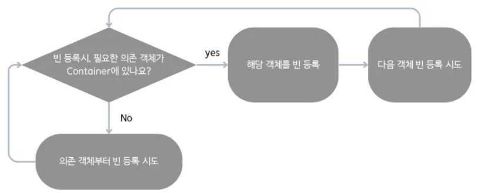
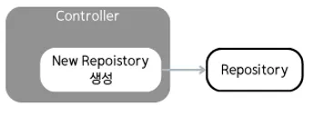
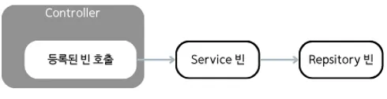

# **Spring 스타일의 경량 DI 프레임워크**

*자체 서버 프레임워크 문제를 해결하기 위해 Spring Container 동작을 직접 구현한 프로젝트*

### **1. Component Scan을 통한 빈 등록 및 싱글톤 관리**

- **Component Scan** 방식을 사용하여 단순한 의존성 주입 요구사항을 충족
- `@Component`와 `@Autowired` 어노테이션을 직접 구현하여 빈 등록 및 의존성 주입 처리
- **생성자 기반 의존성 주입**을 사용하여 의존 객체를 명확하고 안전하게 관리
- **싱글톤 패턴**을 적용하여 애플리케이션 전역에서 동일한 빈 인스턴스를 재사용하도록 구현

### **2. DFS 기반 의존 객체 주입을 통한 초기화 순서 보장**

- **아직 생성되지 않은 객체가 주입되는 문제를 방지**하기 위해 빈 등록 및 생성 순서를 보장
- 빈 등록 과정에서, **필요한 의존 객체가 먼저 생성되었는지 확인**:
  - 필요한 의존 객체가 아직 생성되지 않은 경우, 해당 객체를 우선적으로 생성 및 등록
  - 필요한 의존 객체가 이미 생성된 경우, 이를 사용하여 현재 빈을 등록
- 모든 빈을 **DFS** 기반으로 탐색하며, 의존 객체를 해결한 뒤 순차적으로 컨테이너에 등록

### 3. 자체 서버 프레임워크와 Spring Container를 연계한 서비스 제공

- 자체 서버 프레임워크에서 클라이언트 요청을 Controller와 연동하는 구조는 유지
- 서비스 적용 전

  - Controller에서 직접 Repository를 생성하여 요청마다 새로운 객체를 생성 → **메모리 낭비**
  - 높은 결합도로 인해 유지보수가 어려움
- 서비스 적용 후

  - Controller가 Spring Container에서 빈을 호출해 재사용 → **메모리 사용량 80% 이상 절감**
  - 빈을 통해 의존 객체를 주입받아 **결합도가 낮아지고 유지보수성이 개선**됨

### **4. 구현한 Spring Container와 JUnit을 연동한 테스트 코드 작성**

- **`@BeforeAll` 어노테이션**을 사용하여 테스트 실행 전에 단 **한 번 Spring Container를 초기화**하여 설정
- 초기화된 Spring Container에서 **Bean을 가져와 각 테스트에서 재사용**하도록 설계
- 직접 구현한 Spring Container의 **의존성 주입**, **Singleton 동작**, **빈 등록 및 호출**이 올바르게 동작하는지 검증하는 테스트 코드 작성